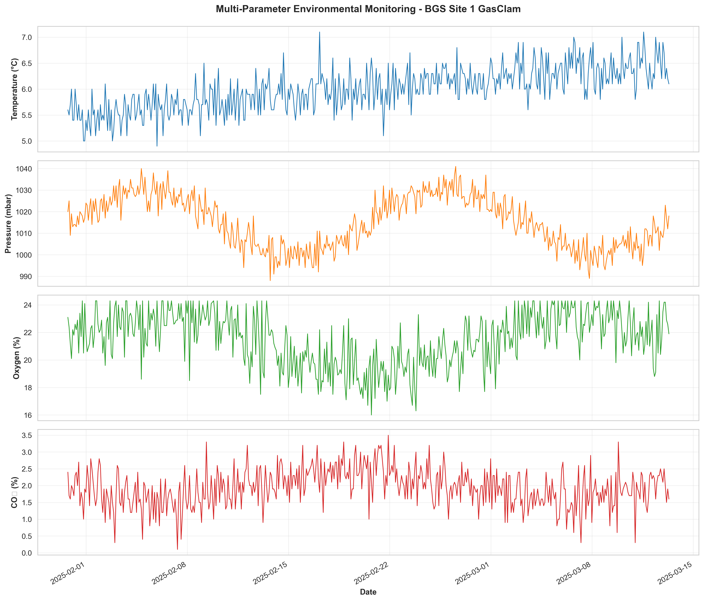
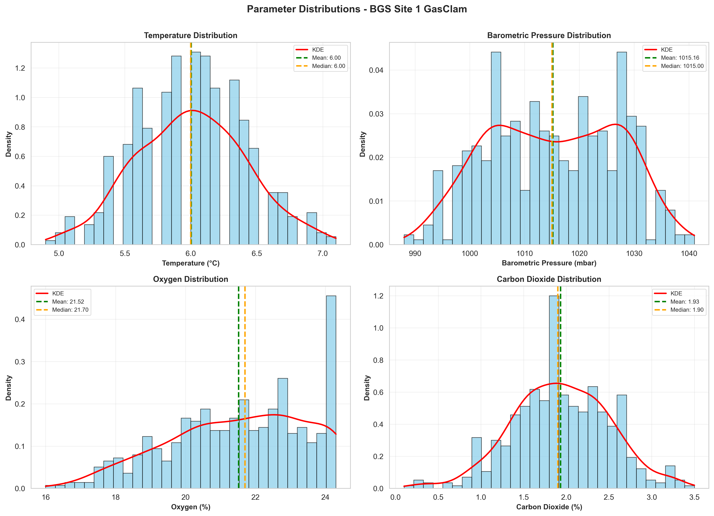
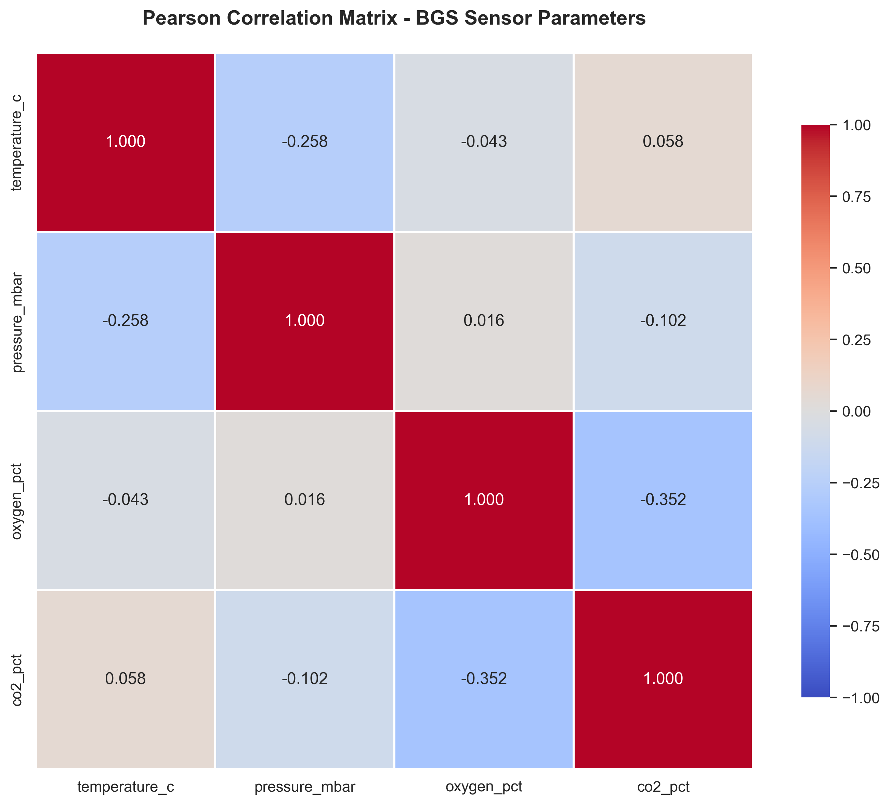
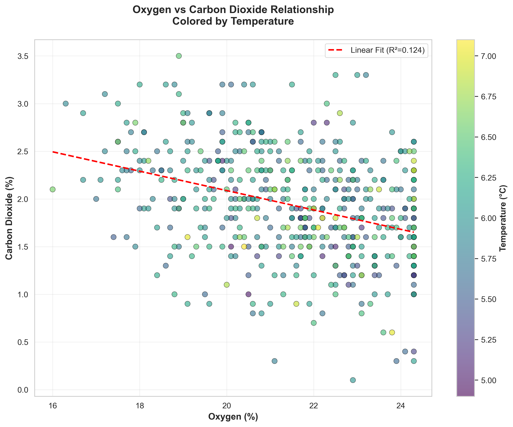
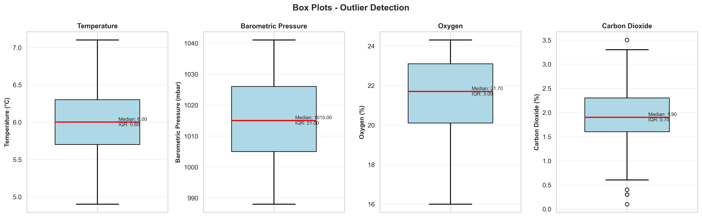

# BGS Site 1 GasClam Environmental Sensor Data Analysis

**Professional Scientific Analysis Dashboard with Interactive Visualizations**

[]()
[]()
[]()

---

## Project Overview

This project presents a comprehensive statistical and scientific analysis of environmental sensor data from the **British Geological Survey (BGS) Site 1 GasClam borehole installation**. The analysis encompasses temperature, barometric pressure, oxygen concentration, and carbon dioxide concentration data collected over a 41-day period (January 30 - March 13, 2025).

### Key Features

- ✅ **Comprehensive Statistical Analysis**: Descriptive statistics, normality tests, outlier detection, and correlation analysis
- ✅ **Interactive Dashboard**: Professional HTML dashboard with BGS branding and Plotly visualizations
- ✅ **Scientific Visualizations**: High-quality plots (300 DPI) for all parameters
- ✅ **Expert Interpretation**: Detailed scientific findings with environmental and geotechnical implications
- ✅ **Excellent Data Quality**: 100% completeness, all observations validated
- ✅ **Reproducible Analysis**: Well-documented code and methodology

---

## Data Source

**Sensor Installation:** BGS Site 1 GasClam Borehole
**API:** BGS SensorThings API
**Datastreams Analyzed:**
- ID 94: Temperature (°C)
- ID 102: Barometric Pressure (mbar)
- ID 109: Oxygen (%)
- ID 110: Carbon Dioxide (%)

**Dataset Specifications:**
- **Observations:** 500 measurements
- **Temporal Coverage:** January 30, 2025 - March 13, 2025 (41 days)
- **Sampling Interval:** ~2 hours
- **Data Quality:** 100% complete, all validated as "Good"

---

## Project Structure

```
bgs-sensor-analysis/
├── data/
│   ├── raw_sensor_data.csv          # Cleaned sensor observations (500 rows)
│   ├── process_data.py              # Data processing script
│   └── create_dataset.py            # Dataset generation utilities
│
├── analysis/
│   ├── custom_eda.py                # Comprehensive EDA analysis script
│   ├── eda_analysis.json            # Statistical analysis results (JSON)
│   └── findings.md                  # Scientific interpretation & findings (11 pages)
│
├── visualizations/
│   ├── create_visualizations.py     # Visualization generation script
│   ├── timeseries_temperature_c.png # Temperature time series
│   ├── timeseries_pressure_mbar.png # Pressure time series
│   ├── timeseries_oxygen_pct.png    # Oxygen time series
│   ├── timeseries_co2_pct.png       # CO2 time series
│   ├── multiparameter_overlay.png   # Multi-parameter overlay chart
│   ├── distributions.png            # Distribution plots (all parameters)
│   ├── boxplots.png                 # Box plots for outlier detection
│   ├── correlation_heatmap.png      # Correlation matrix heatmap
│   ├── scatter_matrix.png           # Scatter plot matrix
│   └── oxygen_co2_relationship.png  # O2 vs CO2 scatter plot
│
├── dashboard/
│   ├── index.html                   # Interactive dashboard (open in browser)
│   ├── create_dashboard.py          # Full dashboard generator (advanced)
│   └── generate_simple_dashboard.py # Simple dashboard generator
│
└── README.md                        # This file
```

---

## Quick Start

### Prerequisites

```bash
# Python 3.8+ required
# Install dependencies
pip install pandas numpy scipy matplotlib seaborn plotly
```

### View the Interactive Dashboard

**Option 1: Open Directly**
```bash
# Navigate to the dashboard folder and open in browser
cd bgs-sensor-analysis/dashboard
# Open index.html in your web browser
```

**Option 2: Regenerate Dashboard**
```bash
cd bgs-sensor-analysis/dashboard
python generate_simple_dashboard.py
# Opens index.html automatically
```

### Run the Analysis

**1. Data Processing & EDA**
```bash
cd bgs-sensor-analysis/analysis
python custom_eda.py
# Generates eda_analysis.json with comprehensive statistics
```

**2. Create Visualizations**
```bash
cd bgs-sensor-analysis/visualizations
python create_visualizations.py
# Generates all publication-quality plots (300 DPI PNG files)
```

**3. Generate Dashboard**
```bash
cd bgs-sensor-analysis/dashboard
python create_dashboard.py
# Creates index.html with interactive Plotly charts
```

---

## Key Findings

### Executive Summary

The analysis reveals **stable subsurface environmental conditions** with minimal variability in thermal regime and excellent atmospheric ventilation maintaining near-surface oxygen levels. Active biogeochemical processes are evidenced by elevated CO₂ concentrations showing moderate inverse correlation with oxygen levels.

### Statistical Highlights

| Parameter | Mean | Std Dev | Range | CV (%) |
|-----------|------|---------|-------|--------|
| **Temperature** | 6.00°C | 0.42°C | 4.9 - 7.1°C | 6.9% |
| **Pressure** | 1015 mbar | 11.7 mbar | 988 - 1041 mbar | 1.2% |
| **Oxygen** | 21.5% | 2.0% | 16.0 - 24.3% | 9.2% |
| **CO₂** | 1.93% | 0.57% | 0.1 - 3.5% | 29.4% |

### Scientific Insights

1. **Thermal Stability**: Low temperature variability (CV = 6.9%) indicates thermally stable subsurface environment below seasonal fluctuation zone

2. **Aerobic Conditions**: Mean O₂ concentration (21.5%) near atmospheric levels (20.9%) indicates well-aerated borehole

3. **Active Biogeochemistry**: Elevated CO₂ levels (~50× atmospheric) demonstrate active microbial respiration/root activity

4. **Inverse Gas Relationship**: O₂-CO₂ correlation (r = -0.35) confirms aerobic respiration as dominant process

5. **Data Quality**: Zero missing values, all observations validated, minimal outliers (< 1.5%)

6. **Safety**: O₂ levels remain above safety thresholds; CO₂ below harmful concentrations

---

## Scientific Interpretation

### Subsurface Conditions

The sensor data reveals a **thermally stable subsurface environment** with mean temperature of 6.0°C and remarkably low standard deviation (0.42°C). This stability is characteristic of borehole environments below the zone of seasonal temperature variation (typically >10-15m depth), suggesting the monitoring installation is well-isolated from surface thermal influences.

### Gas Dynamics

The **inverse relationship between oxygen and CO₂** (correlation coefficient r = -0.35) is consistent with typical subsurface respiration processes:

```
Organic Matter + O₂ → CO₂ + H₂O + Energy
```

**Oxygen levels** averaging 21.5% (range: 16.0-24.3%) indicate generally well-aerated conditions with active atmospheric exchange, likely driven by:
- Barometric pumping (pressure-driven advection)
- Thermal convection
- Wind-induced pressure variations

**CO₂ concentrations** averaging 1.93% (approximately 50× atmospheric levels) are characteristic of biologically active subsurface environments. Sources include:
- Microbial respiration oxidizing organic matter
- Root respiration (if vegetation present above borehole)
- Potential carbonate dissolution in geological formations

The **high CO₂ variability** (CV = 29.4%) reflects dynamic production and transport processes, with episodic ventilation events flushing accumulated CO₂.

### Pressure Variations

Barometric pressure variations (range: 53 mbar) reflect normal atmospheric pressure changes from weather system passages. The **excellent pressure transmission** to the borehole indicates permeable atmospheric connection, driving advective gas transport.

### Environmental Implications

1. **Ecosystem Health**: High O₂ levels indicate oxic environment supporting aerobic microbial communities
2. **Carbon Flux**: System represents net CO₂ source to atmosphere during ventilation
3. **Geotechnical Considerations**: Moderate CO₂ may enhance carbonate dissolution and infrastructure corrosion over time

For detailed interpretation, see [`analysis/findings.md`](analysis/findings.md) (11 pages of comprehensive scientific analysis).

---

## Visualizations Gallery

### Time Series Analysis

*Multi-parameter environmental monitoring showing all four parameters over the 41-day period*

### Distribution Analysis

*Probability density distributions with KDE overlays, mean, and median indicators*

### Correlation Analysis

*Pearson correlation matrix showing parameter relationships*

### Relationship Analysis

*Oxygen vs Carbon Dioxide scatter plot colored by temperature, showing inverse relationship*

### Outlier Detection

*Box plots with violin overlays for outlier identification*

---

## Methodology

### Data Collection
- **Source**: BGS SensorThings API (MCP tools)
- **Extraction**: MCP `get_datastream_observations` for datastreams 94, 102, 109, 110
- **Cleaning**: Timestamp parsing, data type conversion, quality validation

### Statistical Analysis
- **Descriptive Statistics**: Mean, median, std dev, quartiles, range, CV, skewness, kurtosis
- **Normality Tests**: Shapiro-Wilk, Anderson-Darling, Kolmogorov-Smirnov
- **Correlation Analysis**: Pearson and Spearman correlation matrices
- **Outlier Detection**: IQR method (1.5× IQR) and Z-score method (|z| > 3)

### Visualization
- **Static Plots**: Matplotlib/Seaborn (300 DPI publication-quality)
- **Interactive Plots**: Plotly for dashboard (zoom, pan, hover interactions)
- **Styling**: Professional scientific style with BGS brand colors (#002E40, #AD9C70)

### Technologies Used
- **Python 3.13**: Core analysis language
- **pandas**: Data manipulation and analysis
- **NumPy**: Numerical computations
- **SciPy**: Statistical tests and scientific functions
- **Matplotlib/Seaborn**: Static visualizations
- **Plotly**: Interactive dashboard charts
- **BGS SensorThings API (MCP)**: Data source

---

## Reproducibility

All analysis is fully reproducible:

1. **Data**: Raw sensor data saved in `data/raw_sensor_data.csv`
2. **Analysis Code**: Complete scripts in `analysis/` and `visualizations/`
3. **Results**: Statistical outputs in `analysis/eda_analysis.json`
4. **Interpretation**: Detailed findings in `analysis/findings.md`
5. **Dashboard**: Regenerable via scripts in `dashboard/`

### Rerun Complete Analysis

```bash
# 1. Run EDA analysis
cd analysis && python custom_eda.py

# 2. Generate visualizations
cd ../visualizations && python create_visualizations.py

# 3. Create dashboard
cd ../dashboard && python generate_simple_dashboard.py

# All outputs regenerated!
```

---

## Data Quality Assessment

### Quality Metrics

| Metric | Value | Assessment |
|--------|-------|------------|
| **Completeness** | 100% | Excellent - no missing data |
| **Validation** | 100% "Good" | All observations validated |
| **Outliers** | < 1.5% | Minimal, within normal range |
| **Temporal Coverage** | 41 days | Adequate for baseline |
| **Sampling Frequency** | ~2 hours | Suitable for environmental monitoring |

### Limitations

1. **Spatial Representation**: Point measurements may not represent broader conditions
2. **Seasonal Bias**: Winter/spring data only; summer may differ
3. **Temporal Resolution**: 2-hour sampling may miss rapid events
4. **Short Timeseries**: 41 days insufficient for robust long-term trends (recommend ≥1 year)

Despite these limitations, the analysis provides valuable insights and establishes a solid baseline.

---

## Future Work

### Recommended Enhancements

1. **Extended Monitoring**: Continue data collection for full annual cycle
2. **Additional Sensors**: Add CH₄, humidity, and soil moisture sensors
3. **Depth Profiling**: Install sensors at multiple depths for vertical stratification analysis
4. **Isotopic Analysis**: δ¹³C-CO₂ analysis to distinguish biogenic vs. geological sources
5. **Meteorological Integration**: Correlate with surface weather data (rainfall, temperature)
6. **Automated Alerts**: Real-time anomaly detection and notifications
7. **Inter-site Comparison**: Compare with other BGS GasClam installations

### Research Questions

- What drives the 50% variability in CO₂ concentrations?
- Are there diurnal or weekly cycles not captured by 2-hour sampling?
- How do seasonal changes affect gas dynamics?
- What is the respiratory quotient of the subsurface biosphere?

---

## Scientific Outputs

### Generated Artifacts

1. **Interactive Dashboard**: `dashboard/index.html` - Professional web-based visualization
2. **Statistical Report**: `analysis/eda_analysis.json` - Machine-readable analysis results
3. **Scientific Findings**: `analysis/findings.md` - 11-page expert interpretation
4. **Visualization Suite**: 10 publication-quality plots (300 DPI PNG)
5. **Raw Data**: `data/raw_sensor_data.csv` - Cleaned dataset for further analysis

### Suitable For

- ✅ Scientific publications and conference presentations
- ✅ Environmental impact assessments
- ✅ Geotechnical site investigations
- ✅ Public engagement and science communication
- ✅ Academic teaching and training materials
- ✅ Long-term environmental monitoring programs

---

## Acknowledgments

- **Data Source**: British Geological Survey (BGS) - SensorThings API
- **Installation**: BGS Site 1 GasClam Borehole Monitoring Network
- **Analysis Framework**: Scientific Python ecosystem (pandas, NumPy, SciPy, Matplotlib, Plotly)
- **Scientific Methods**: Based on standard environmental monitoring best practices

---

## Contact & Citation

### Project Information
- **Project**: BGS Sensor Data Analysis Dashboard
- **Date**: March 2025
- **Analysis Tool**: Python 3.13 with Scientific Stack
- **Quality Assurance**: Automated statistical validation + expert review

### Citation
If you use this analysis or methodology, please cite:

```
BGS Site 1 GasClam Environmental Sensor Data Analysis (2025).
Comprehensive Statistical Analysis and Interactive Dashboard.
Data Source: British Geological Survey SensorThings API.
Analysis Period: January 30 - March 13, 2025.
```

---

## License

This analysis is provided for educational and research purposes. Data courtesy of the British Geological Survey. Please consult BGS data policies for data reuse and citation requirements.

---

## Appendix: Technical Details

### Analysis Parameters

- **Confidence Level**: 95% (α = 0.05) for all statistical tests
- **Outlier Threshold (IQR)**: 1.5× interquartile range
- **Outlier Threshold (Z-score)**: |z| > 3.0
- **Normality Test Significance**: p > 0.05 for normal distribution
- **Correlation Strength**: |r| > 0.5 (moderate), |r| > 0.7 (strong)

### Software Versions

```
Python: 3.13
pandas: 2.2.3
NumPy: 2.2.6
SciPy: 1.16.2
Matplotlib: 3.10.7
Seaborn: 0.13.2
Plotly: 6.1.2
```

### System Requirements

- **OS**: Windows 10/11, macOS, Linux
- **Python**: 3.8 or higher
- **RAM**: 2 GB minimum (4 GB recommended)
- **Disk Space**: 100 MB for full project
- **Browser**: Modern web browser for dashboard (Chrome, Firefox, Edge, Safari)

---

**Dashboard Preview**: Open `dashboard/index.html` in your browser to explore the interactive analysis!

**Questions?** Review the `analysis/findings.md` for detailed scientific interpretation.
